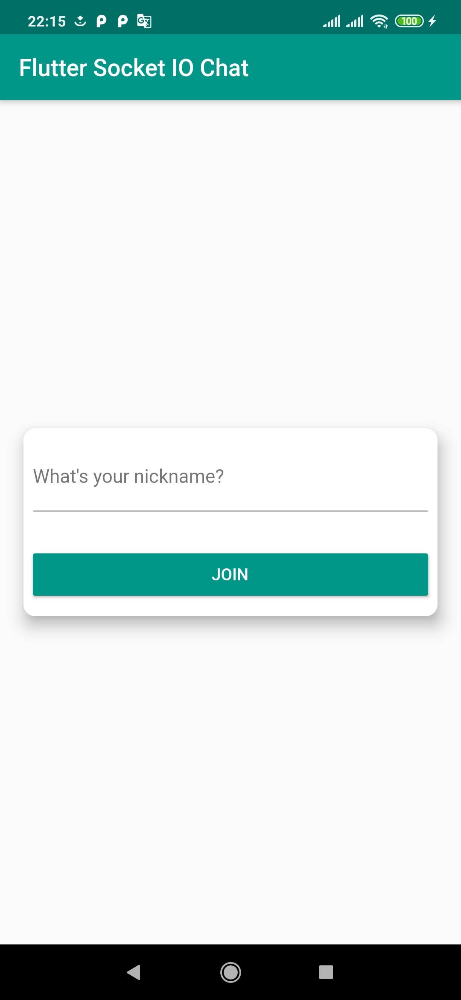
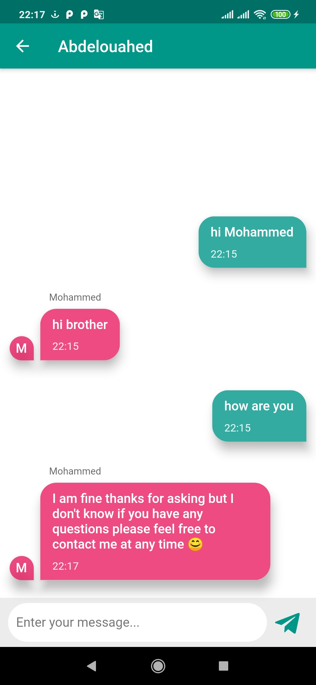
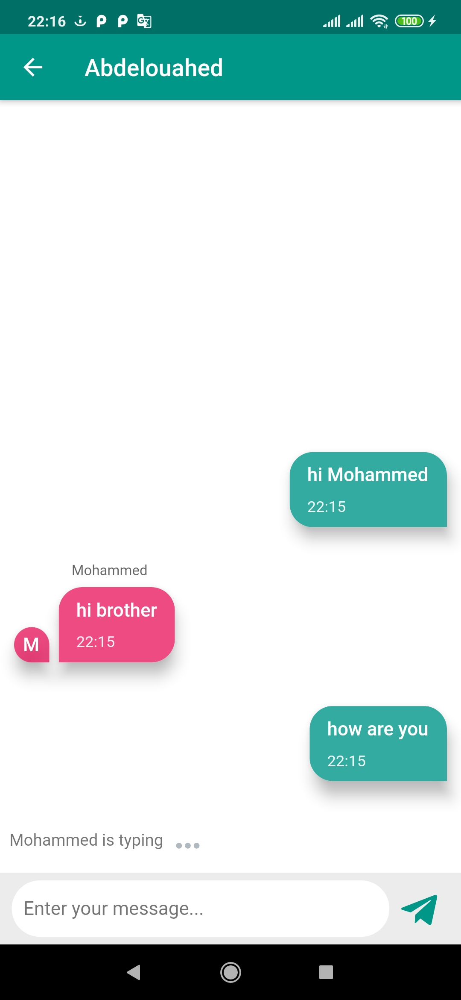

# Flutter Socket IO Chat

A Flutter chat app built with Socket IO.

### Screenshots
| Join | Messages | Typing
|------|-------|-------|
||||

## 🔌 Plugins
| Name |
|------|
|[**Flutter Socket IO**](https://pub.dev/packages/flutter_socket_io)
|[**Provider**](https://pub.dev/packages/provider)
|[**Font Awesome Flutter**](https://pub.dev/packages/font_awesome_flutter)
|[**Intl**](https://pub.dev/packages/intl)
|[**Lottie**](https://pub.dev/packages/lottie)

### [Backend code](https://github.com/GeekAbdelouahed/Socket-Io-Chat-app)
